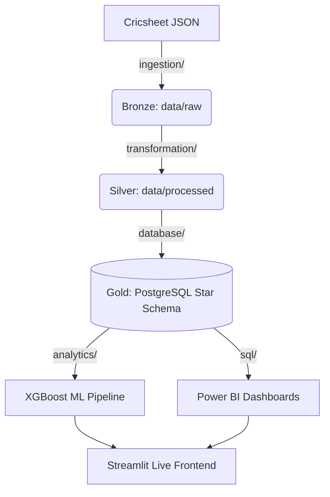
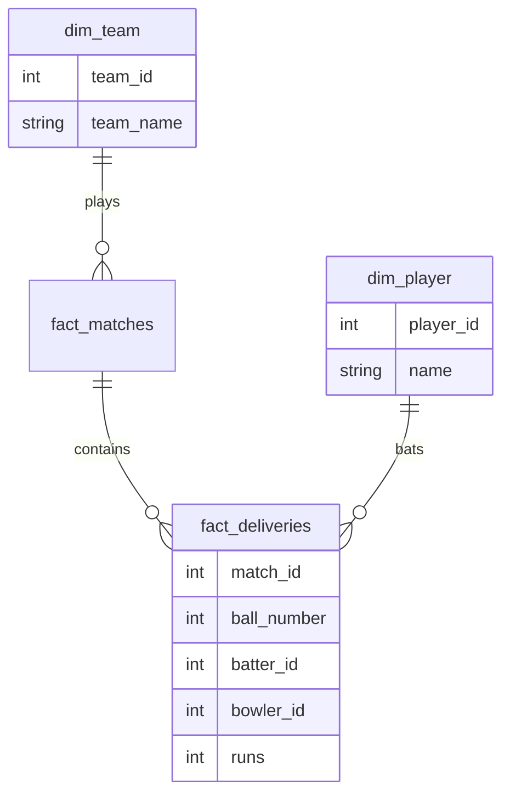

# Portfolio Presentation: IPL Analytics & Decision Intelligence Platform

## Project Summary
This project is an end-to-end data engineering, analytics, and machine learning pipeline. It ingests 1,243 granular, nested JSON files from Cricsheet, transforms them using a Medallion Architecture (Bronze -> Silver -> Gold), stores them in a PostgreSQL Star Schema, and serves a live XGBoost-powered win probability model through a containerized Streamlit frontend. 

---

## Pre-Demo Checklist (Verification)
Ensure the following commands run successfully on your local machine prior to presenting:

- [x] **Application Startup**: `docker-compose up -d --build` (Verifies Postgres and Streamlit boot).
- [x] **Database Setup**: `docker exec -it ipl_postgres psql -U postgres -d ipl_dw -c "\dt"` (Verifies tables exist).
- [x] **Test Suite**: `pytest tests/` (Ensure 22/22 tests pass).
- [x] **Streamlit Access**: Open `http://localhost:8501` in your browser.
- [x] **Links**: Verify `docs/erd.png` and `reports/figures/` exist.

---

## 5-10 Minute Demonstration Flow

### 1. The Problem Statement (1 min)
*Explain the gap in current sports analytics.*
"While typical cricket dashboards show historical stats, they fail to encapsulate the dynamic, ball-by-ball tension of a T20 run chase. Our goal was to build a platform that not only catalogs history but predicts live match outcomes strictly using data available at the exact moment of the delivery, avoiding target leakage."

### 2. Show Architecture (1 min)
*Open this Mermaid diagram in the presentation:*

### 3. Data Lineage: Raw → Bronze → Silver → Gold (1 min)
- **Action**: Open `data/raw/` to show a raw nested JSON file (Bronze). 
- **Action**: Show `data/processed/matches.csv` to demonstrate standardizing (Silver).
- **Action**: Highlight that missing venues were programmatically imputed and team names were standardized (e.g., Rising Pune Supergiants).

### 4. PostgreSQL & ERD (1 min)
*Explain the Data Warehouse structure.*
- **Action**: Show the Entity Relationship Diagram.

### 5. SQL Analysis (1 min)
*Demonstrate advanced SQL techniques.*
- **Action**: Open `sql/analysis/queries.sql`.
- **Highlight**: Show the Toss Impact query using Window Functions and CTEs to prove that certain venues possess a massive statistical advantage for chasing teams.

### 6. Power BI Dashboards (1 min)
- **Action**: Share screenshots of the 5-page Power BI Dashboard.
- **Highlight**: Mention that all Power BI metrics are natively validated in Python via `tests/test_analytics.py` to prevent dashboard hallucinations.

### 7. ML Predictor & Target Leakage (1.5 min)
*Explain the predictive engine.*
- **Action**: Open `src/analytics/feature_engineering.py`.
- **Highlight**: Emphasize how `shift()` operations were used to calculate `runs_remaining` and `wickets_lost`. "If we are predicting the outcome of Ball 10, the model only sees the score exactly as it was after Ball 9. `win_margin` and `winner` are strictly excluded."
- **Results**: State that XGBoost achieved an ROC-AUC of 0.81 on futuristic out-of-bag seasons (2024+).

### 8. SHAP Explainability (1 min)
*Prove model transparency.*
- **Action**: Open `reports/figures/shap_summary.png`.
- **Explain**: Show how the model isn't a black box. Point out that SHAP definitively proves `Required Run Rate` and `Wickets Lost` are the highest drivers of negative win probability during a chase.

### 9. Streamlit Application (1 min)
*Live interaction.*
- **Action**: Open `http://localhost:8501`.
- **Action**: Go to the "Match Win Predictor" page.
- **Demo**: Input a hypothetical scenario (e.g., CSK chasing 180 vs MI at Wankhede, currently 100/2 in 12 overs). Click predict and show the live probability bars dynamically adjust.

### 10. Engineering Standards & Testing (0.5 min)
*Conclude with DevOps robustness.*
- **Action**: Show `.github/workflows/tests.yml` and the 22-test Pytest suite.
- **Highlight**: The pipeline guarantees data integrity bounds (e.g., `current_score` cannot exceed `target_score` in the UI). Everything is natively containerized in Docker for seamless handoffs.

---
**End of Demo**
