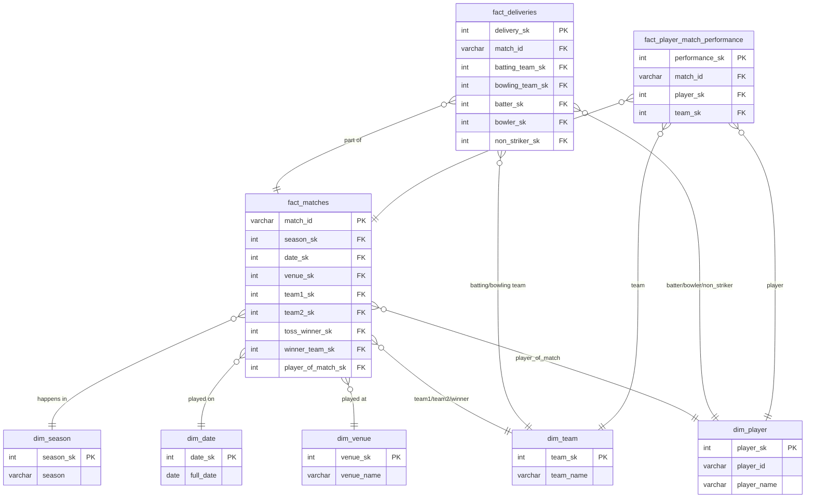

# Entity Relationship Diagram (ERD)

```mermaid
erDiagram
    dim_team {
        int team_sk PK
        varchar team_name
    }
    dim_player {
        int player_sk PK
        varchar player_id
        varchar player_name
    }
    dim_venue {
        int venue_sk PK
        varchar venue_name
    }
    dim_season {
        int season_sk PK
        varchar season
    }
    dim_date {
        int date_sk PK
        date full_date
    }
    
    fact_matches {
        varchar match_id PK
        int season_sk FK
        int date_sk FK
        int venue_sk FK
        int team1_sk FK
        int team2_sk FK
        int toss_winner_sk FK
        int winner_team_sk FK
        int player_of_match_sk FK
    }
    
    fact_deliveries {
        int delivery_sk PK
        varchar match_id FK
        int batting_team_sk FK
        int bowling_team_sk FK
        int batter_sk FK
        int bowler_sk FK
        int non_striker_sk FK
    }
    
    fact_player_match_performance {
        int performance_sk PK
        varchar match_id FK
        int player_sk FK
        int team_sk FK
    }

    fact_matches }o--|| dim_season : "happens in"
    fact_matches }o--|| dim_date : "played on"
    fact_matches }o--|| dim_venue : "played at"
    fact_matches }o--|| dim_team : "team1/team2/winner"
    fact_matches }o--|| dim_player : "player_of_match"
    
    fact_deliveries }o--|| fact_matches : "part of"
    fact_deliveries }o--|| dim_team : "batting/bowling team"
    fact_deliveries }o--|| dim_player : "batter/bowler/non_striker"
    
    fact_player_match_performance }o--|| fact_matches : "performance in"
    fact_player_match_performance }o--|| dim_player : "player"
    fact_player_match_performance }o--|| dim_team : "team"
```
